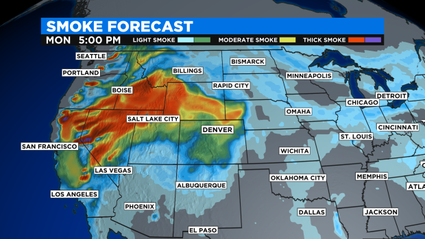
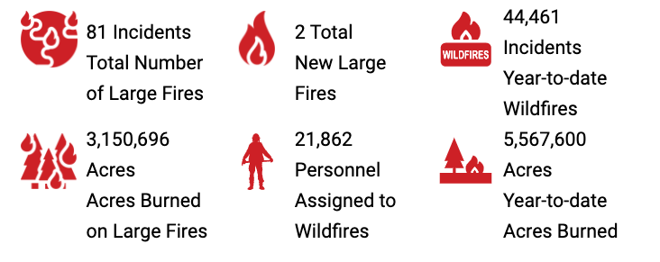

\newpage  
\tableofcontents  
\listoffigures  
\newpage

Introduction
==================
```{r library dependency, warning=FALSE, message=FALSE, echo=TRUE}
library(RSQLite)
library(tidyverse)
library(dbplyr)
library(lubridate)
library(data.table)
library(scales)
library(usmap)
library(kableExtra)
library(png)
```

Motivation
------------------------------------------
{#id1 .class width="50%" height="50%"}  

The noticeable air pollution in Colorado state has reached in a certain level that state government recommends that active children and adults reduce prolonged or heavy outdoor activities. This high concentration of smoke mostly originating from California but a handful of fires in Colorado will also contribute to the smoky skies according to [**Figure 1**](https://denver.cbslocal.com/2021/08/30/denver-weather-the-break-is-over-heat-and-smoke-return-on-monday/) from CBS report on Denver weather on August 30th, 2021.  

The main motivation behind this project is to give a reference for travel enthusiasts and hiking when they starting to road trip to Colorado or other state in U.S., potentially avoid their regrets of smoky weather and limited area due to wildfire. We wants to build an interactive application and report on Wildfire in U.S. which present clean and clear graphs and conclusion based on user's options such as fire frequency, fire size, and fire cause.  

Secondary motivation in hindsight will hopefully be able to grab attention from certain state government so that they can make some policies to mitigate the wildfire size and flat the curve of property loss from wildfire, which is definitely help a lot to the safety of local citizen in that state.  

Related Applications 
------------------------------------------
{#id2 .class width="51%" height="51%"}  

There are several open source tables and application that related to my project. Thanks them for these data models, they provide some inspirations to our subtopic, like [**Figure 2**](https://www.nifc.gov/fire-information/statistics) from National Interagency Fire Center on current wildfire statistics, which show me a view of national wildland fire summaries. 

In CAL FIRE website, we are able to view a list of table about California wildfire activity with analysis such as “Number of Fires by Cause”, “Dollar Damage by Size”, and “Acres Burned by Vegetation Type”. More importantly, it has a nice work flow to discuss all the plots based on research which we can learn from it.  

The [**CAL FIRE**](https://www.fire.ca.gov/) website is powered by California Department of Forestry and Fire Protection, under the direction of the state Board of forestry and fire protection. This interactive web tool shows that details wildfire information annually. They have highlighted the essential data such as Large Fires 300 Acres and Greater so important data are transparent to users.  


Observations and Questions
------------------------------------------
From the existing web applications and tables, we find most of these data products having too much information even somewhat messy. The main problem is that they do not have options for users to choose what kind of information they want to view and compare so they just pop up a long form report including all the details.

For example, it do give essential data such as fire size, fire cause, burned acres, and etc. However, it also include Not that important data such as incident #, reporting department, and fire name.  

In our project, our analysis will focus on essential information for travel enthusiasts and hiking such as wildfire counts state wise, wildfire frequency graph based on yearly report, and fire cause ranking barplot, and etc. In this way, our report will be more efficient and useful compared to the existing research based on wildfires in the U.S.

Our hypothesis is to explore which state has the most wildfire, which fire cause has the most contribution for national wildfire, and which month has the most wildfire counts yearly.  

\newpage 

Design of Data and Methodology  
====================================

Data Resource and Explanation of Variables 
------------------------------------------
The aim of data collection definitely focus on if the dataset contains fire size column, fire cause column, and state/county column. Ideally, we want to a dataset contains yearly report for wildfire in U.S. so that we can plot a date trend series graph based on that dataset. Wildfire data is somewhat difficult to find - with many sites limiting it to online tools.    

Thanks to [**U.S. DEPARTMENT OF AGRICULTURE**](https://www.fs.usda.gov/rds/archive/Catalog/RDS-2013-0009.5), we were able to get a table of information of 2,166,753 wildfire in U.S. from 1992 to 2018, along with fire cause, discovery date, fire size as shown in Table 1.  
```{r Getting dataset, echo=TRUE, warning=FALSE}
# create db connection
conn <- dbConnect(SQLite(), 'FPA_FOD_20210617.sqlite')

# pull the fires table into RAM
fires <- tbl(conn, "Fires") %>% collect()

# disconnect from db
dbDisconnect(conn)

# select the column we need for this project
fires <- fires[,c('FIRE_NAME', 'DISCOVERY_DATE', 'NWCG_CAUSE_CLASSIFICATION', 
                  'NWCG_GENERAL_CAUSE','CONT_DATE', 'FIRE_SIZE',
                  'FIRE_SIZE_CLASS', 'LATITUDE', 'LONGITUDE',
                  'STATE', 'COUNTY', 'FIPS_CODE','FIPS_NAME')]
```

```{r description for variable, echo=TRUE, warning=FALSE}
# get column names and rename
fire_df_colname <- matrix(colnames(fires), ncol = 1)
colnames(fire_df_colname)[1] <- "Related-Variable"
# cbind the description for variable
fire_df_colname <- cbind(fire_df_colname, 
                         Description=c('Name of the incident from the fire report', 
                                                        'Date on which the fire was discovered or confirmed to exist.',
                                                        'Code for the (statistical) cause of the fire', 
                                                        'Description of the (statistical) cause of the fire.', 
                                                        'Date on which the fire was declared contained or otherwise controlled (mm/dd/yyyy where mm=month, dd=day, and yyyy=year).', 
                                                        'Estimate of acres within the final perimeter of the fire.', 
                                                        'Code for fire size based on the number of acres within the final fire perimeter expenditures (A=greater than 0 but less than or equal to 0.25 acres, B=0.26-9.9 acres, C=10.0-99.9 acres, D=100-299 acres, E=300 to 999 acres, F=1000 to 4999 acres, and G=5000+ acres).', 
                                                        'Latitude (NAD83) for point location of the fire (decimal degrees).', 
                                                        'Longitude (NAD83) for point location of the fire (decimal degrees).', 
                                                        'Two-letter alphabetic code for the state in which the fire burned (or originated), based on the nominal designation in the fire report.', 
                                                        'County, or equivalent, in which the fire burned (or originated), based on nominal designation in the fire report.', 
                                                        'Unit code (follows state code to create UnitId).', 
                                                        'Unit name'))
text_tbl <- as.data.frame(fire_df_colname)
```

```{r kable related variable, echo=TRUE, warning=FALSE}
# kable related variable
kbl(text_tbl, booktabs = T, longtable = T, 
    caption = "The related-variables in our data set.") %>%
  kable_styling(full_width = T) %>%
  column_spec(1, color = "red") %>%
  column_spec(2, width = "25em")
```

These related-variables are documented and will be used for our research after reshaping and analyzing the original dataset. Having a data product on U.S. wildfire is useful and necessary for travel enthusiasts and hiking who want to have a point of reference before they make a plan for travel vocation.   

The data for this project was obtained via the websites mentioned above and compiled into one sqlite file to be read into R. Although the data set is good, it is missing some values and certain information. So, after we read the sqlite file, we use the na.omit function to remove empty spots inside the data set and use the usmap library to filter the state name column of the data set.   

The description for each variable inside the dataset can be found in the [**Kaggle** dataset website](https://www.kaggle.com/rtatman/188-million-us-wildfires). This website provides the yearly wildfire data for the United States. Although it is an out-of-date dataset but the description for the variable still useful for our dataset. This website provides reshaped data to some extent which is originally from the [national Fire Program Analysis (**FPA**)](https://www.usda.gov/). From those sites, enough data was obtained to create two interactive and informative data plots.   


Preparing the Data 
------------------------------------------
Reshape original data to readable data set is a major part of this report. We spend a lot of time to extract data using several different functions of library and package in R.   

The data set originally comes from the US Department of Agriculture. The most comprehensive and easily accessible data cames from this webisite which allows for a .sqlite download! Unfortunately it's in a very wide format that is not ready for analysis, but tidyr R library can make quick work of that with pivot_longer().   

It has a massive amount of data, we have filtered it down to a few tables as seen in the attached .sqlite files. Before we use this data set to explore the wildfires in the US on their own, by geographic area, fire size, we have applied functions to reshape the data set. Here is the summary of the process:    

1. Drill in on the seemingly most wildfire impacted state/Country using the "include" parameter in the plot_usmap() function. State/County divisions can be found in the doc of us_regdiv.pdf here.   

2. There were lots of missing data for fire size and fire cause which will be counted in the summary so we remove these rows when we want to compare these fire cause in general and fire size in general.      

3. Due to different categories for the dataset, we only use couple columns in the data set in order to not duplicate the information such as fire cause, discovery date are duplicated in this data sets, just different format.   

4. Original history data set do not use typically date but in the format such as '2/2/2005 0:00' format, we change them to date variable type so that we can plot data year by year.    

5. In order to compare the wildfire in state wise, we have to calculate the average wildfire frequency for each state per year because there are too many wildfire for each year.     

6. We have a docs for each columns field for the data set. In order to illustrate them to readers, we create a table for each columns names and descriptions for that to help understand.     

7. In order to zoom in the area of our findings, we use filter function to only display the corresponding information. For example, the highest wildfire frequency state we only display specific state instead of whole US map.  

8. Showing all the column names and explain each column to readers is hard but we use colnames function to get all column names first. Then I use cbind to append explanation and description. Finally, showing the table using extrakable function.   


R Library Foundations of the Project
------------------------------------------
This project may be imported into the RStudio environment and compiled by researchers wishing to reproduce this work for newest plot with future data sets, and having new findings or discussions from that.    

> The Core of Statistics were done using R 4.1.0 (R Core Team, 2021-05-18), the ggplot2 (v3.3.5; RStudio Team, 2021-06-25), and the knitr (v1.34; Yihui, 2021-09-08) packages.

For **ggplot2** package, this package has been used for creating graphics such as box plot, line plot, bar plot, and density plot from my reshaped data sets. With built-in theme, we are able to generate decent plots map variables to aesthetics with details to present in this report.      

From **knitr** package, this report is constructed to have reproducibility that it can regenerate the plot based on the latest dataset contains yearly report in the future. Using literate programming techniques for dynamic report generation in R.    

> The Initial Scenarios package is usmap 0.5.2 (Paolo Di Lorenzo, 2021-01-21).

For **usmap** package, we use plot_usmap(based on ggplot object) to plot state wise US map in convenient. The map data frames include Alaska and Hawaii conveniently placed to the bottom left, as they appear in most maps of the US. More over, it built-in function from U.S. Census Bureau help us to filter and divide the whole US map into four regions, which help us to zoom in specific area to analyze.     

> The Most Frequently Used package is dplyr (v1.0.7; RStudio Team, 2021-06-18).

For **dplyr** package, we use a lot of functions to reshape our data set and working with data frame through mutate, filter, arrange, group_by, summarize_all functions. Most of modification to the data set were using these functions list above.    

* **Note**: There are few functions has been used to reshape the data set in other packages. Due to limited usage, we will not list all these packages in this report such as melt function in reshape2 package; readPNG function in png package. 

\newpage


Exploration
====================================

Title 1 
------------------------------------------

```{r average wildfire count by Day of Year, fig.cap="Average Number of US Wildfires by Day of Year. Observe the trend of wildfires count over Time",  out.width='98%', out.height='98%', echo=TRUE, warning=FALSE}
fires_1 <- as.data.frame(fires)
fires_1$DISCOVERY_DATE<-as.Date(fires_1$DISCOVERY_DATE, format = "%m/%d/%Y")
fires_1 <- fires_1 %>%
  mutate(day = format(DISCOVERY_DATE, "%d"),
         month = format(DISCOVERY_DATE, "%m"), 
         year = format(DISCOVERY_DATE, "%Y")) %>%
  group_by(month, day) %>%
  summarise(total = n()) %>%
  mutate(date = make_date(month = month, day = day))
ggplot() +
  geom_line(aes(x = date, y = total/27), fires_1, color = 'orange') +
  scale_x_date(date_breaks= "1 month", date_labels = "%b") +
  xlab("Day of Year") + ylab("Number of wildfire") +
  theme(plot.background = element_rect(fill = "#BFD5E3"))
```


\newpage

Title 2 
------------------------------------------
```{r Number of Wildfires by Size Class, fig.cap="Number of US Wildfires by Size Class per year. ", out.width='99%', out.height='99%', echo=TRUE, warning=FALSE}
fires_2 <- as.data.frame(fires)
size_classes <- c('A' = '0-0.25', 'B' = '0.26-9.9',
                  'C' = '10.0-99.9', 'D' = '100-299',
                  'E' = '300-999', 'F' = '1000-4999',
                  'G' = '5000+')
fires_2 <- fires_2 %>%
  group_by(FIRE_SIZE_CLASS) %>%
  summarize(total = n()) %>%
  mutate(FIRE_SIZE_CLASS = size_classes[FIRE_SIZE_CLASS])
ggplot(data = fires_2, aes(x=FIRE_SIZE_CLASS, y = total/27, fill =FIRE_SIZE_CLASS)) + 
  geom_bar(stat = "identity") + scale_fill_brewer(palette = "Reds") +
  xlab("Fire size (acres)") + ylab("Number of wildfires") +
  geom_text(label = paste0(round(fires_2$total/sum(fires_2$total)*100, 1), "%")) +
  theme(plot.background = element_rect(fill = "#BFD5E3"))
```
\newpage

Title 3
------------------------------------------

```{r Number of wildfires by cause, fig.cap="Number of US Wildfires by cause type. ", out.width='97%', out.height='97%', echo=TRUE, warning=FALSE}
fires_3 <- as.data.frame(fires)
fires_3 <- fires_3 %>%
  group_by(NWCG_CAUSE_CLASSIFICATION) %>%
  summarize(total = n()) %>%
  na.omit() %>%
  arrange(desc(total))
ggplot(data = fires_3) + 
  geom_bar(aes(x = "", y = total, fill = NWCG_CAUSE_CLASSIFICATION), stat = "identity") +   
  geom_text(aes(x = "", y = total, label = paste0(round(total / sum(total) * 100, 1), "%"))) +
  coord_polar(theta = "y") +
  theme_void()
```
\newpage

Title 4
------------------------------------------
```{r Number of wildfires by cause 2, fig.cap="Number of US Wildfires by cause type 2. ", out.width='91%', out.height='91%', echo=TRUE, warning=FALSE}
fires_4 <- as.data.frame(fires)
fires_4 <- fires_4 %>%
  group_by(NWCG_GENERAL_CAUSE) %>%
  summarize(total = n()/1000) %>%
  na.omit() %>%
  arrange(desc(total))
ggplot(data = fires_4) + 
  geom_bar(aes(x = reorder(NWCG_GENERAL_CAUSE, total), y = total), stat = "identity", fill = 'orange') + 
  coord_flip() +
  xlab("NWCG_GENERAL_CAUSE") + ylab("Number of wildfires (thousands)") +
  theme(plot.background = element_rect(fill = "#BFD5E3"))
```
\newpage

Title 5
------------------------------------------
```{r relationship between fire size and cause, fig.cap="average wildfire size by cause. ", out.width='96%', out.height='96%', echo=TRUE, warning=FALSE}
fires_5 <- as.data.frame(fires)
fires_5 <- fires_5 %>%
  group_by(NWCG_GENERAL_CAUSE) %>%
  summarize(mean_size = mean(FIRE_SIZE, na.rm = TRUE)) %>%
  na.omit() %>%
  arrange(desc(mean_size))
ggplot(data = fires_5) + 
  geom_bar(aes(x = reorder(NWCG_GENERAL_CAUSE, mean_size), y = mean_size), stat = "identity", fill = 'orange') + 
  coord_flip() +
  xlab("NWCG_GENERAL_CAUSE") + ylab("Acres") +
  theme(plot.background = element_rect(fill = "#BFD5E3"))
```
\newpage

Title 6
------------------------------------------
```{r fig.width=12, fig.height=8, fig.cap="US Wildfres, 1992-2018. The spectrum from white to darkred indicates more wildfires in that state", out.width='100%', out.height='100%', echo=TRUE, warning=FALSE}
fires_6 <- as.data.frame(fires)
fires_6 <- fires_6 %>%
  group_by(STATE) %>%
  summarize(total = n()) %>%
  na.omit()
fires_6 <- as.data.frame(fires_6)
colnames(fires_6)[1] = "state"
plot_usmap(data = fires_6, values = "total", color = "red", labels = TRUE) + 
  scale_fill_continuous(low = "white", high = "darkred", 
                        name = "Number of fires", label = scales::comma) + 
  theme(legend.position = "right",
        legend.title = element_text(size=16), 
        legend.text = element_text(size=18),
        plot.title = element_text(size=24),
        plot.caption = element_text(size=20),
        panel.background = element_rect(colour = "black"))
```
\newpage

Title 7
------------------------------------------
```{r fig.width=12, fig.height=8, fig.cap="US Wildfires in CA, 1992-2018. The spectrum from white to darkred indicates more wildfires in that state", out.width='101%', out.height='101%', echo=TRUE, warning=FALSE}
fires_7 <- as.data.frame(fires)
fires_7 <- fires_7 %>%
  filter(STATE == 'CA') %>%
  group_by(FIPS_CODE) %>%
  summarize(total = n()) %>%
  na.omit()
fires_7 <- as.data.frame(fires_7)
colnames(fires_7)[1] = "fips"
plot_usmap(data = fires_7, values = "total", "counties", include = c("CA"), labels = TRUE) +
  scale_fill_continuous(low = "white", high = "darkred", name = "Number of fires", label = scales::comma) +
  theme(legend.position = "right",
        legend.title = element_text(size=16), 
        legend.text = element_text(size=10),
        plot.title = element_text(size=24),
        plot.caption = element_text(size=20),
        panel.background = element_rect(colour = "black"))
```
\newpage

Problems Tackled and Conclusion
====================================

\newpage

References
====================================


