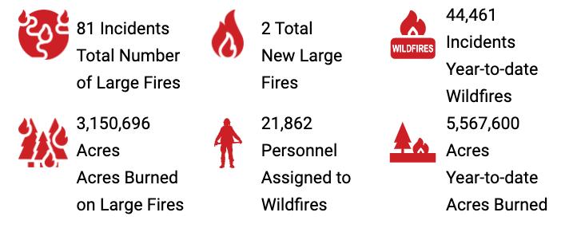

\newpage  
\tableofcontents  
\listoffigures  
\newpage

Introduction
==================
```{r library dependency, message=FALSE, warning=FALSE, include=FALSE}
library(RSQLite)
library(tidyverse)
library(dbplyr)
library(lubridate)
library(data.table)
library(scales)
library(usmap)
library(kableExtra)
library(png)
```

Motivation
------------------------------------------
{#id1 .class width="50%" height="50%"}  
Wildfires, like many other natural disasters, demand everyones' attention. From being a direct threat to the constant reminder of a smoke caused haze. The smoke from the California wildfires in 2021 has massively impacted the air quality of Colorado State. The noticeable air pollution this year reached certain levels that the state government recommended active children and adults reduce prolonged or heavy outdoor activities. This impact helped inspire this report.  

The general motivation behind this project is to understand the history of wildfires in the US, see how they've changed over time and understand when and where they are most severe. The following questions are what this report will specifically try to answer.


1. Have the number of wildfires increased over time? Have the fires that occur become more severe?
2. During which time of the year is there the most wildfire activity?
3. Which states have the most wildfire activity? Of the top state, which counties had the most wildfires activity?

Work space link: https://github.com/Firewatch-DTSC5301/wildfire

\newpage 

Design of Data and Methodology  
====================================

Data Resource and Explanation of Variables 
------------------------------------------
The dataset used for this report was found via the US Department of Agriculture. It provides information on 2,166,753 wildfires in the U.S. from 1992-2018, with a variety of information including spacial, cause, size, discovery/containment dates and different classifications.  

Thanks to [**U.S. DEPARTMENT OF AGRICULTURE**](https://www.fs.usda.gov/rds/archive/Catalog/RDS-2013-0009.5) for providing the dataset.
```{r Getting dataset, echo=TRUE, warning=FALSE}
# create db connection
conn <- dbConnect(SQLite(), 'FPA_FOD_20210617.sqlite')
# pull the fires table into RAM
fires <- tbl(conn, "Fires") %>% collect()

# disconnect from db
dbDisconnect(conn)
# select the column we need for this project
fires <- fires[,c('FIRE_NAME', 'FIRE_YEAR', 'DISCOVERY_DATE', 
                  'NWCG_CAUSE_CLASSIFICATION', 
                  'NWCG_GENERAL_CAUSE', 'FIRE_SIZE',
                  'FIRE_SIZE_CLASS',
                  'STATE', 'FIPS_CODE')]
```

```{r description for variable, echo=TRUE, warning=FALSE}
# get column names and rename
fire_df_colname <- matrix(colnames(fires), ncol = 1)
colnames(fire_df_colname)[1] <- "Related-Variable"
# cbind the description for variable
fire_df_colname <- 
  cbind(fire_df_colname, 
        Description=
        c('Name of the incident from the fire report', 
          'Date of Year on that fire',
          'Date on which the fire was discovered or confirmed to exist',
          'Code for the (statistical) cause of the fire', 
          'Description of the (statistical) cause of the fire.', 
          'Estimate of acres within the final perimeter of the fire.', 
          'Code for fire size based on the number of acres within the final fire perimeter expenditures (A=greater than 0 but less than or equal to 0.25 acres, B=0.26-9.9 acres, C=10.0-99.9 acres, D=100-299 acres, E=300 to 999 acres, F=1000 to 4999 acres, and G=5000+ acres).', 
          'Two-letter alphabetic code for the state in which the fire burned (or originated), based on the nominal designation in the fire report.', 
          'Numbers which uniquely identify geographic areas.'))
text_tbl <- as.data.frame(fire_df_colname)
```

```{r kable related variable, echo=TRUE, warning=FALSE}
# kable related variable
kbl(text_tbl, booktabs = T, longtable = T, 
    caption = "The Variables of Interest in the Dataset") %>%
  kable_styling(full_width = T) %>%
  column_spec(1, color = "red") %>%
  column_spec(2, width = "25em")
```


The data for this project was obtained via the websites mentioned above and compiled into one sqlite file to be read into R. There are some missing some values and certain information. The na.omit function was used to remove empty rows from the dataset and the usmap library was used to filter the state name column of the dataset.   

The description for each variable inside the dataset can be found in the [**Kaggle** dataset website](https://www.kaggle.com/rtatman/188-million-us-wildfires). This website provides the yearly wildfire data for the United States. Although it is an out-of-date dataset the description for the variable still useful for our dataset. This website provides reshaped data to some extent which is originally from the [national Fire Program Analysis (**FPA**)](https://www.usda.gov/).  


Preparing the Data 
------------------------------------------
The following was done to prepare the dataset for analysis:   

1. Drill in on States/Counties impacted most by wildfires using the "include" parameter in the plot_usmap() function.

2. Remove rows missing information on fire size and fire cause.    

3. Due to different categories for the dataset, only a subset of the columns were used in order to not duplicate the information.

4. Format date information to a more usable form.    

5. Create a table that provides more information about each variable in the dataset.


R Library Foundations of the Project
------------------------------------------
This project may be imported into the RStudio environment and compiled by researchers wishing to reproduce this work for newest plot with future data sets, and having new findings or discussions from that.    

> The Core of Statistics were done using R 4.1.0 (R Core Team, 2021-05-18), the ggplot2 (v3.3.5; RStudio Team, 2021-06-25), and the knitr (v1.34; Yihui, 2021-09-08) packages.

**ggplot2** Package: this package has been used for creating graphics such as box plot, line plot, bar plot, and density plot from the reshaped datasets.

**knitr** Package: this report is constructed to have reproducibility that it can regenerate the plot based on the latest dataset contains yearly report in the future, using literate programming techniques for dynamic report generation in R.    

> The Initial Scenarios package is usmap 0.5.2 (Paolo Di Lorenzo, 2021-01-21).

*usmap** Package: we use plot_usmap(based on ggplot object) to plot the US map. The map data frames include Alaska and Hawaii placed to the bottom left.

> The Most Frequently Used package is dplyr (v1.0.7; RStudio Team, 2021-06-18).

**dplyr** Package: many functions were used to reshape the dataset and working with data frames.

Note: There were other packages used for limited purposes, they are not listed here. 

\newpage


Exploration
====================================

Number of Fires Over Time
------------------------------------------
```{r echo=TRUE, message=FALSE, warning=FALSE}

fires_date <- fires %>% 
  select(FIRE_YEAR, FIRE_SIZE) %>% 
  group_by(FIRE_YEAR) %>% 
  summarise(Total_Fires = n(), Burn_Size = sum(FIRE_SIZE))

fires_date %>% ggplot(aes(x= FIRE_YEAR)) + 
  geom_col(aes(y = Total_Fires), fill = "darkred") + 
  stat_smooth(aes(method = "lm", y = Total_Fires), color = "darkblue", fill = "royalblue") +
  scale_x_continuous(name = " Year", 
                     breaks = round(seq(min(fires_date$FIRE_YEAR), 
                                        max(fires_date$FIRE_YEAR), by = 2),1)) +
  scale_y_continuous(name = "# of Fires", labels = scales::comma) + 
  ggtitle("Total Fires per Year") +
  theme_bw()

```


Fire Severity Over Time
------------------------------------------

```{r Wildfire Severity, echo=TRUE, message=FALSE, warning=FALSE}

fires_date %>% ggplot(aes(x= FIRE_YEAR)) + 
  geom_line(aes(y = Burn_Size),size = 1, color = "darkred") + 
  stat_smooth(aes(method = "lm", y = Burn_Size), fill = "royalblue", color = "darkblue") +  
  scale_x_continuous(name = " Year", 
                     breaks = round(seq(min(fires_date$FIRE_YEAR), 
                                        max(fires_date$FIRE_YEAR), by = 2),1)) +
  scale_y_continuous(name = "Acres", labels = scales::comma) + 
  ggtitle("Total Acres Burned per Year") +
  theme_bw()

```

Observing the first plot, *Total Fires Per Year*, it shows the number of fires has not increased. In fact the data shows there was a peak around 2006 after which the number of fires decreased. However, the second plot, *Total Acres Burned per Year*, shows that the number of acres burned per year, or the severity of the fires that year, has steadily increased.

\newpage

Time Period with the Most Wildfire Activity
------------------------------------------

```{r average wildfire count by Day of Year, fig.cap="Average Number of Acres Burned by Day of Year",  out.width='98%', out.height='98%', echo=TRUE, warning=FALSE}
fires_1 <- as.data.frame(fires)
fires_1$DISCOVERY_DATE<-as.Date(fires_1$DISCOVERY_DATE, format = "%m/%d/%Y")
fires_1 <- fires_1 %>%
  mutate(day = format(DISCOVERY_DATE, "%d"),
         month = format(DISCOVERY_DATE, "%m"), 
         year = format(DISCOVERY_DATE, "%Y")) %>%
  group_by(month, day) %>%
  summarise(total = sum(FIRE_SIZE)/27) %>%
  mutate(date = make_date(month = month, day = day))
ggplot() +
  geom_line(aes(x = date, y = total), fires_1, color = 'darkred') +
  scale_x_date(date_breaks= "1 month", date_labels = "%b") +
  xlab("Day of Year") + ylab("Number of Acres Burned") +
  theme(plot.background = element_rect(fill = "#BFD5E3"))
```


\newpage

States with the Most Wildfire Activity
------------------------------------------
```{r fig.width=12, fig.height=8, fig.cap="US Wildfres, 1992-2018. The spectrum from white to darkred indicates more wildfires in that State", out.width='110%', out.height='110%', echo=TRUE, warning=FALSE}
fires_6 <- as.data.frame(fires)
fires_6 <- fires_6 %>%
  group_by(STATE) %>%
  summarize(total = sum(FIRE_SIZE)/27) %>%
  na.omit()
fires_6 <- as.data.frame(fires_6)
colnames(fires_6)[1] = "state"
plot_usmap(data = fires_6, values = "total", color = "darkred", exclude = c("AK"), labels = TRUE) + 
  scale_fill_continuous(low = "white", high = "darkred", 
                        name = "Acres Burned per Year", label = scales::comma) + 
  theme(legend.position = "right",
        legend.title = element_text(size=16), 
        legend.text = element_text(size=18),
        plot.title = element_text(size=24),
        plot.caption = element_text(size=20),
        panel.background = element_rect(colour = "black"))
```

CA Counties with the Most Wildfire Activity
------------------------------------------
```{r fig.width=12, fig.height=8, fig.cap="US Wildfires in CA, 1992-2018. The spectrum from white to darkred indicates more wildfires in that county", out.width='101%', out.height='101%', echo=TRUE, warning=FALSE}
fires_7 <- as.data.frame(fires)
fires_7 <- fires_7 %>%
  filter(STATE == 'CA') %>%
  group_by(FIPS_CODE) %>%
  summarize(total = sum(FIRE_SIZE)/27) %>%
  na.omit()
fires_7 <- as.data.frame(fires_7)
colnames(fires_7)[1] = "fips"
plot_usmap(data = fires_7, values = "total", "counties", include = c("CA"), labels = FALSE, size = 0.4) +
  scale_fill_continuous(low = "white", high = "darkred", name = "Acres Burned per Year", label = scales::comma) +
  theme(
        legend.position = "right",
        legend.title = element_text(size=16), 
        legend.text = element_text(size=18),
        plot.title = element_text(size=24),
        plot.caption = element_text(size=22),
        panel.background = element_rect(colour = "black"))
```
\newpage

Conclusion and Sources of Bias
====================================
The conclusion that can be drawn from the first two plots is the number of wildfires has not increased during the time frame of the data set. However the total number of acres burned per year has steadily increased, indicating the severity of the fires has gotten worse over time. 

Some possible problems with the data influence these conclusions however. It's unclear if the method of counting wildfires has changed over the years. It's possible what used to count as a wildfire does not, or in other terms, fires that occurred in the 90's might not count as a wildfire now, and would not be included in the data. Another possible issue is how the acres burned per fire is tracked and recorded. Over the years how they estimate the total acres may have changed as technologies (such as satellite imaging) have improved. Both of these possible biases could be influencing the findings in this section, as they are occurring over time.

\newpage

Further Exploration
====================================


Wildfire by Size Class
------------------------------------------
```{r Number of Wildfires by Size Class, fig.cap="Number of Wildfires by Size Class", out.width='99%', out.height='99%', echo=TRUE, warning=FALSE}
fires_2 <- as.data.frame(fires)
size_classes <- c('A' = '0-0.25', 'B' = '0.26-9.9',
                  'C' = '10.0-99.9', 'D' = '100-299',
                  'E' = '300-999', 'F' = '1000-4999',
                  'G' = '5000+')
fires_2 <- fires_2 %>%
  group_by(FIRE_SIZE_CLASS) %>%
  summarize(total = n()/27) %>%
  mutate(FIRE_SIZE_CLASS = size_classes[FIRE_SIZE_CLASS])
ggplot(data = fires_2, aes(x=FIRE_SIZE_CLASS, y = total, fill =FIRE_SIZE_CLASS)) + 
  geom_bar(stat = "identity") + scale_fill_brewer(palette = "Reds") +
  xlab("Number of Acres Burned") + ylab("Number of wildfires per Year") +
  geom_text(label = paste0(round(fires_2$total/sum(fires_2$total)*100, 1), "%")) +
  theme(plot.background = element_rect(fill = "#BFD5E3"))
```
\newpage

Wildfires by Cause Classification
------------------------------------------

```{r Number of wildfires by cause, fig.cap="Number of US Wildfires by Cause Type. ", out.width='97%', out.height='97%', echo=TRUE, warning=FALSE}
fires_3 <- as.data.frame(fires)
fires_3 <- fires_3 %>%
  group_by(NWCG_CAUSE_CLASSIFICATION) %>%
  summarize(total = n()) %>%
  na.omit() %>%
  arrange(desc(total))
ggplot(data = fires_3) + 
  geom_bar(aes(x = "", y = total, fill = NWCG_CAUSE_CLASSIFICATION), stat = "identity") +   
  geom_text(aes(x = "", y = total, label = paste0(round(total / sum(total) * 100, 1), "%"))) +
  coord_polar(theta = "y") +
  theme_void() +
  theme(legend.position = "right",
        legend.title = element_text(size=10), 
        legend.text = element_text(size=8))
```
\newpage


Wildfires by General Cause
------------------------------------------
```{r relationship between fire size and cause, fig.cap="Average Wildfire Size by Cause", out.width='96%', out.height='96%', echo=TRUE, warning=FALSE}
fires_5 <- as.data.frame(fires)
fires_5 <- fires_5 %>%
  group_by(NWCG_GENERAL_CAUSE) %>%
  summarize(mean_size = mean(FIRE_SIZE, na.rm = TRUE)) %>%
  na.omit() %>%
  arrange(desc(mean_size))
ggplot(data = fires_5) + 
  geom_bar(aes(x = reorder(NWCG_GENERAL_CAUSE, mean_size), y = mean_size), stat = "identity", fill = 'darkred') + 
  coord_flip() +
  xlab("WILDFIRE CAUSE") + ylab("Number of Acres Burned per Fire") +
  theme(plot.background = element_rect(fill = "#BFD5E3"))
```
\newpage


Possible Extensions
====================================

From the information gleaned in further exploration section, it's clear this dataset has much more that can be explored. Extensions of this report include analyzing wildfire causes and how they relate to locations (are certain causes more common in certain parts of the U.S?) as well as building interactive maps, that could show how fire severity has changed over time across the U.S.

\newpage

Related Information and Inspiration 
====================================
The following provided some inspiration for this project:

{#id2 .class width="51%" height="51%"}  

[**Figure 2**](https://www.nifc.gov/fire-information/statistics) from National Interagency Fire Center on current wildfire statistics. 


The [**CAL FIRE**](https://www.fire.ca.gov/) website is powered by California Department of Forestry and Fire Protection, under the direction of the state Board of Forestry and Fire Protection. This interactive web tool shows that details wildfire information annually.

\newpage

References
====================================
[1] Colorado's Air Quality is Pretty Bad Today And Will Get Worse             
   https://www.cpr.org/2021/08/05/colorado-air-quality-bad-today-will-get-worse/ 

[2] California WildFires (2013-2020)  - Kaggle Data website,  
    https://www.kaggle.com/ananthu017/california-wildfire-incidents-20132020

[3] Spatial wildfire occurrence data for the United States, 1992-2018  - U.S. Department of Agriculture,  
    https://www.fs.usda.gov/rds/archive/Catalog/RDS-2013-0009.5
    
[4] R Core Team, R: A Language and Environment for Statistical Computing, R Foundation for Statistical Computing, Vienna, Austria,  
    http://www.R-project.org/, 2021

[5] Yihui Xie knitr: A general-purpose package for dynamic report generation in R,  
    http://yihui.name/knitr/, 2021
    
[6] Different Ways of Plotting U.S. Map in R,  
   https://jtr13.github.io/cc19/different-ways-of-plotting-u-s-map-in-r.html#using-usmap-package, 2021
    
[7] Census Regions and Divisions of the United States - U.S. Census Bureau,  
    https://www2.census.gov/geo/pdfs/maps-data/maps/reference/us_regdiv.pdf, 2021
    
[8] Easy way to mix multiple graphs on the same page - ggplot2 package,  
    http://www.sthda.com/english/articles/24-ggpubr-publication-ready-plots/81-ggplot2-easy-way-to-mix-multiple-graphs-on-the-same-page/    

[9] 1.88 Million US Wildfires - Kaggle Data website,  
    https://www.kaggle.com/rtatman/188-million-us-wildfires
    
[10] Figures, Tables, Captions - R Markdown for Scientists,  
    https://rmd4sci.njtierney.com/figures-tables-captions-.html, 2021

[11] Yang Liu ggplot US state heatmap - usmap package,  
    https://liuyanguu.github.io/post/2020/06/12/ggplot-us-state-and-china-province-heatmap/, 2021

